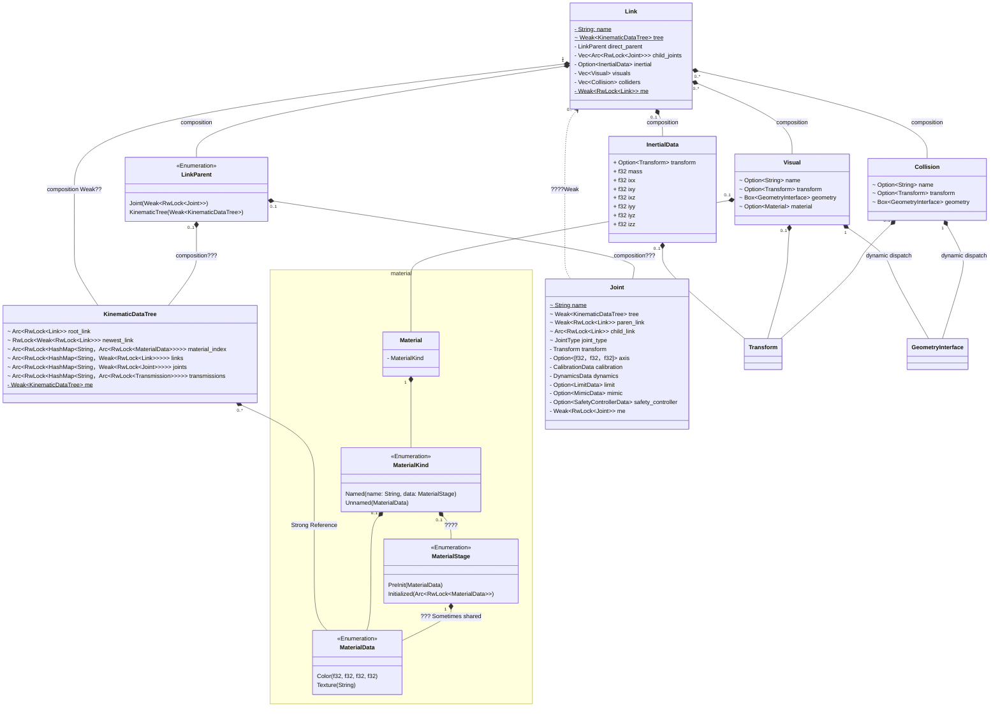

Standard mermaid notation is used

# Probably not fully up to date

```mermaid

classDiagram
	class KinematicDataTree{
		~ Arc~RwLock~Link~~ root_link
		~ RwLock~Weak~RwLock~Link~~~ newest_link
		~ Arc~RwLock~HashMap~String，Arc~RwLock~MaterialData~~~~~ material_index 
		~ Arc~RwLock~HashMap~String，Weak~RwLock~Link~~~~~ links
		~ Arc~RwLock~HashMap~String，Weak~RwLock~Joint~~~~~ joints
		~ Arc~RwLock~HashMap~String，Arc~RwLock~Transmission~~~~~ transmissions
		- Weak~KinematicDataTree~ me$
	}

	KinematicDataTree "0..*" *-- MaterialData: Strong Reference

	class Link{
		- String: name$
		~ Weak~KinematicDataTree~ tree$
		- LinkParent direct_parent
		- Vec~Arc~RwLock~Joint~~~ child_joints
		- Option~InertialData~ inertial
		- Vec~Visual~ visuals
		- Vec~Collision~ colliders
		- Weak~RwLock~Link~~ me$
	}

	Link "1" *-- LinkParent: composition
	Link "1" *-- KinematicDataTree: composition Weak??
	Link "0..*" <.. Joint: ????Weak
	Link "0..1" *-- InertialData: composition
	Link "0..*" *-- Visual: composition
	Link "0..*" *-- Collision: composition

	class LinkParent {
		<<Enumeration>>
		Joint(Weak~RwLock~Joint~~)
		KinematicTree(Weak~KinematicDataTree~)
	}

	LinkParent "0..1" *-- Joint: composition???
	LinkParent "0..1" *-- KinematicDataTree: composition???

	class InertialData {
		+ Option~Transform~ transform
		+ f32 mass
		+ f32 ixx
		+ f32 ixy
		+ f32 ixz
		+ f32 iyy
		+ f32 iyz
		+ f32 izz
	}

	InertialData "0..1" *-- Transform

	class Visual {
		~ Option~String~ name
		~ Option~Transform~ transform
		~ Box~GeometryInterface~ geometry
		~ Option~Material~ material
	}

	Visual "0..1" *-- Transform
	Visual "1" *-- GeometryInterface: dynamic dispatch
	Visual "0..1" *-- Material

	class Collision {
		~ Option~String~ name
		~ Option~Transform~ transform
		~ Box~GeometryInterface~ geometry
	}

	Collision "0..1" *-- Transform
	Collision "1" *-- GeometryInterface: dynamic dispatch

Material "1" *-- MaterialKind
MaterialKind "0..1" *-- MaterialStage: ????
MaterialKind "0..1" *-- MaterialData
MaterialStage "1" *-- MaterialData: ??? Sometimes shared
namespace material{
	class Material {
		- MaterialKind
	}

	class MaterialKind {
		<<Enumeration>>
		Named(name: String, data: MaterialStage)
		Unnamed(MaterialData)
	}
	
	class MaterialData {
		<<Enumeration>>
		Color(f32, f32, f32, f32)
		Texture(String)
	}
	
	class MaterialStage{
		<<Enumeration>>
		PreInit(MaterialData)
		Initialized(Arc~RwLock~MaterialData~~)
	}
}

class Joint {
	~ String name$
	~ Weak~KinematicDataTree~ tree
	~ Weak~RwLock~Link~~ paren_link
	~ Arc~RwLock~Link~~ child_link
	~ JointType joint_type
	- Transform transform
	- Option~[f32，f32，f32]~ axis
	- CalibrationData calibration
	- DynamicsData dynamics
	- Option~LimitData~ limit
	- Option~MimicData~ mimic
	- Option~SafetyControllerData~ safety_controller
	- Weak~RwLock~Joint~~ me
}


	

```