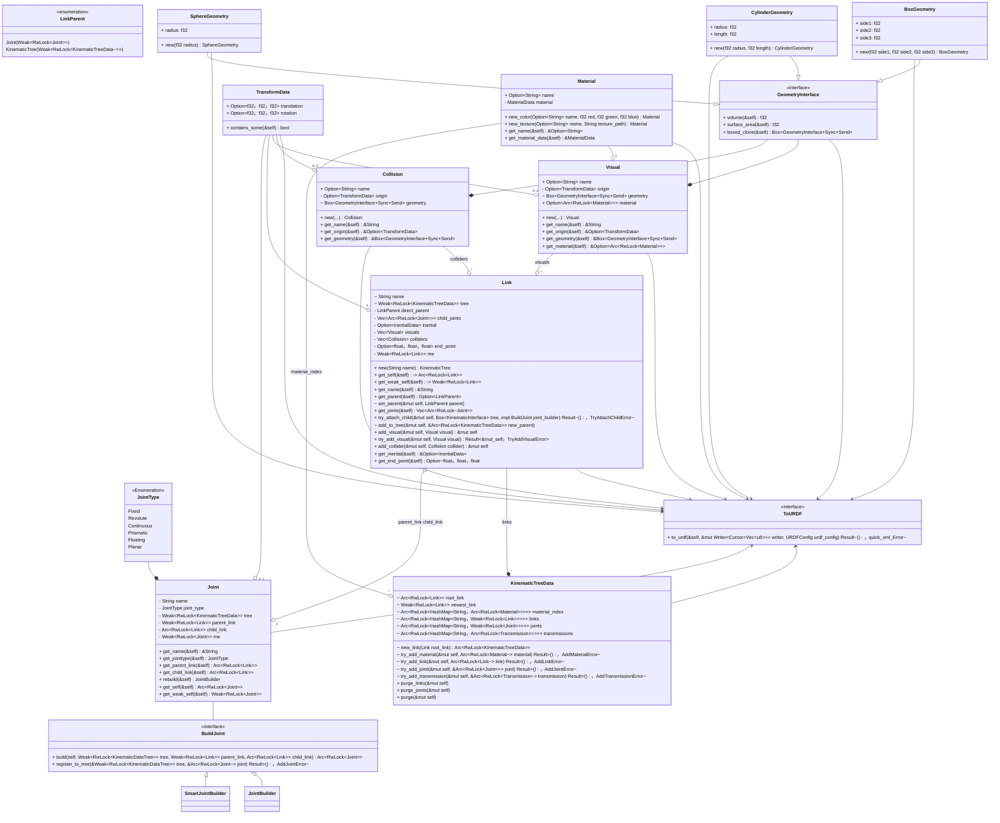

```mermaid
classDiagram
    %% This is how it currently is implemented
%% https://www.visual-paradigm.com/guide/uml-unified-modeling-language/uml-class-diagram-tutorial/
%% READ THAT

%% Start KinematicTreeData
    class KinematicTreeData
    KinematicTreeData : ~ Arc~RwLock~Link~~ root_link
    KinematicTreeData : ~ Weak~RwLock~Link~~ newest_link
    KinematicTreeData : ~ Arc~RwLock~HashMap~String，Arc~RwLock~Material~~~~~ material_index 
    KinematicTreeData : ~ Arc~RwLock~HashMap~String，Weak~RwLock~Link~~~~~ links
    KinematicTreeData : ~ Arc~RwLock~HashMap~String，Weak~RwLock~Joint~~~~~ joints
    KinematicTreeData : ~ Arc~RwLock~HashMap~String，Arc~RwLock~Transmission~~~~~ transmissions

    KinematicTreeData : ~ new_link(Link root_link) Arc~RwLock~KinematicTreeData~~
    
    KinematicTreeData : ~ try_add_material(&mut self, Arc~RwLock~Material~~ material) Result~()，AddMaterialError~
    KinematicTreeData : ~ try_add_link(&mut self, Arc~RwLock~Link~~ link) Result~()，AddLinkError~
    KinematicTreeData : ~ try_add_joint(&mut self, &Arc~RwLock~Joint~~~ joint) Result~()，AddJointError~
    KinematicTreeData : ~ try_add_transmission(&mut self, &Arc~RwLock~Transmission~~ transmission) Result~()，AddTransmissionError~

    
    %% Maybe return purged ID's, might not need to be mutable
    KinematicTreeData : + purge_links(&mut self)
    %% Maybe return purged ID's, might not need to be mutable
    KinematicTreeData : + purge_joints(&mut self)
    %% Maybe return purged ID's or something
    KinematicTreeData : + purge(&mut self)
%% END KinematicTreeData

    class JointBuilder{

    }

    class SmartJointBuilder{

    }

%% START JointInterface
    %% class JointInterface
    %% <<interface>> JointInterface         
%% END JointInterface

    class JointType {
        <<Enumeration>>
        Fixed
        Revolute
        Continuous
	    Prismatic
	    Floating  
        Planar
    }

    %% JointType --* FixedJoint
    %% JointInterface <|-- FixedJoint

    JointType --* Joint

    class Joint {
        - String name
        - JointType joint_type
        - Weak~RwLock~KinematicTreeData~~ tree
        - Weak~RwLock~Link~~ parent_link
        - Arc~RwLock~Link~~ child_link

        - Weak~RwLock~Joint~~ me
    }

        %% Public+Internal API
    Joint : + get_name(&self) &String
    %% Public+Internal API
    Joint : + get_jointtype(&self) JointType

    %% Public+Internal API
    Joint : + get_parent_link(&self) Arc~RwLock~Link~~
    %% Public+Internal API
    Joint : + get_child_link(&self) Arc~RwLock~Link~~

    Joint : + rebuild(&self) JointBuilder

    Joint : + get_self(&self) Arc~RwLock~Joint~~
    Joint : + get_weak_self(&self) Weak~RwLock~Joint~~


    %% JointInterface <|-- Joint

%% START Link
    class Link
    Link : ~ String name
    Link : ~ Weak~RwLock~KinematicTreeData~~ tree
    Link : - LinkParent direct_parent

    Link : - Vec~Arc~RwLock~Joint~~~ child_joints

    Link : - Option~InertialData~ inertial
    Link : - Vec~Visual~ visuals
    Link : - Vec~Collision~ colliders

    Link : - Option~float，float，float~ end_point
    Link : - Weak~RwLock~Link~~ me

    Link : + new(String name) KinematicTree

    Link : + get_self(&self) -> Arc~RwLock~Link~~
    Link : + get_weak_self(&self) -> Weak~RwLock~Link~~

    Link : + get_name(&self) &String
    Link : + get_parent(&self) Option~LinkParent~
    Link : ~ set_parent(&mut self, LinkParent parent)
    Link : + get_joints(&self) Vec~Arc~RwLock~Joint~~
    Link : + try_attach_child(&mut self, Box~KinematicInterface~ tree, impl BuildJoint joint_builder) Result~()，TryAttachChildError~
    Link : ~ add_to_tree(&mut self, &Arc~RwLock~KinematicTreeData~~ new_parent)

    Link : + add_visual(&mut self, Visual visual) &mut self
    Link : + try_add_visual(&mut self, Visual visual) Result~&mut_self，TryAddVisualError~

    Link : + add_collider(&mut self, Collision collider) &mut self
    
    Link : + get_inertial(&self) &Option~InertialData~
    Link : + get_end_point(&self) Option~float，float，float

    Link --> ToURDF
    Link --* "*" KinematicTreeData : links
    Link "*" o--o "2" Joint : parent_link child_link
%% END Link

%% START ToURDF
class ToURDF
<<interface>> ToURDF
ToURDF : + to_urdf(&self, &mut Writer~Cursor~Vec~u8~~~ writer, URDFConfig urdf_config) Result~()，quick_xml_Error~

%% ToURDF <|-- JointInterface
ToURDF <-- KinematicTreeData
ToURDF <-- Joint
%% END ToURDF

%% START LinkParent
class LinkParent{
    <<enumeration>>
    Joint(Weak~RwLock~Joint~~)
    KinematicTree(Weak~RwLock~KinematicTreeData~~~)
}
%% END LinkParent

%% START GEOMETRY
    class GeometryInterface
    <<interface>> GeometryInterface
    GeometryInterface: + volume(&self) f32
    GeometryInterface: + surface_area(&self) f32
    GeometryInterface: + boxed_clone(&self) Box~GeometryInterface+Sync+Send~

    GeometryInterface --> ToURDF

    class BoxGeometry {
        + side1: f32
        + side2: f32
        + side3: f32

        + new(f32 side1, f32 side2, f32 side3) BoxGeometry
    }

    BoxGeometry --|> GeometryInterface
    BoxGeometry --> ToURDF
    
    class CylinderGeometry {
        + radius: f32
        + length: f32

        + new(f32 radius, f32 length) CylinderGeometry
    }

    CylinderGeometry --|> GeometryInterface
    CylinderGeometry --> ToURDF

    class SphereGeometry {
        + radius: f32

        + new(f32 radius) SphereGeometry
    }

    SphereGeometry --> ToURDF
    SphereGeometry --|> GeometryInterface
%% END GEOMETRY

%% START Visual
class Visual {
    + Option~String~ name
    - Option~TransformData~ origin
    ~ Box~GeometryInterface+Sync+Send~ geometry
    + Option~Arc~RwLock~Material~~~ material
}

%% Visual : + new(Option~String~ name, Option~Tranformdata~ origin, Box~GeometryInterface+Sync+Send~ geometry, Option~Arc~RwLock~Material~~~ material) Visual
Visual : + new(...) Visual
Visual : + get_name(&self) &String
Visual : + get_origin(&self) &Option~TransformData~
Visual : + get_geometry(&self) &Box~GeometryInterface+Sync+Send~
Visual : + get_material(&self) &Option~Arc~RwLock~Material~~~

GeometryInterface --* Visual
Visual --> ToURDF
Visual --o "*" Link : visuals
%% End Visual

%% START Collision
    class Collision {
        + Option~String~ name
        - Option~TransformData~ origin
        ~ Box~GeometryInterface+Sync+Send~ geometry
    }

    Collision : + new(...) Collision

    Collision : + get_name(&self) &String
    Collision : + get_origin(&self) &Option~TransformData~
    Collision : + get_geometry(&self) &Box~GeometryInterface+Sync+Send~

    GeometryInterface --* Collision
    Collision --o "*" Link : colliders
    Collision --> ToURDF
    %% Collision --> Clone
%% END Collision

%% BEGIN TransformData
    class TransformData{
        + Option~f32，f32，f32~ translation
        + Option~f32，f32，f32~ rotation

        + contains_some(&self) bool
    }

    TransformData --> ToURDF
    TransformData --o "0..1" Collision
    TransformData --o "0..1" Visual
    TransformData --o "0..1" Link
    TransformData --o "0..1" Joint
%% END TransformData

%% BEGIN Material
    class Material {
        + Option~String~ name
        - MaterialData material
    }

    Material : + new_color(Option~String~ name, f32 red, f32 green, f32 blue) Material
    Material : + new_texture(Option~String~ name, String texture_path) Material

    Material : + get_name(&self) &Option~String~
    Material : + get_material_data(&self) &MaterialData
    
    Material --> ToURDF
    Material --o "1" Visual
    Material --o "*" KinematicTreeData : material_index
%% END Material

%% START BuildJoint 
    class BuildJoint
    <<interface>> BuildJoint
    BuildJoint : + build(self, Weak~RwLock~KinematicDataTree~~ tree, Weak~RwLock~Link~~ parent_link, Arc~RwLock~Link~~ child_link) Arc~RwLock~Joint~~
    BuildJoint : + register_to_tree(&Weak~RwLock~KinematicDataTree~~ tree, &Arc~RwLock~Joint~~ joint) Result~()，AddJointError~

    BuildJoint <|-- JointBuilder
    BuildJoint <|-- SmartJointBuilder
    Joint -- BuildJoint
%% END BuildJoint 

```